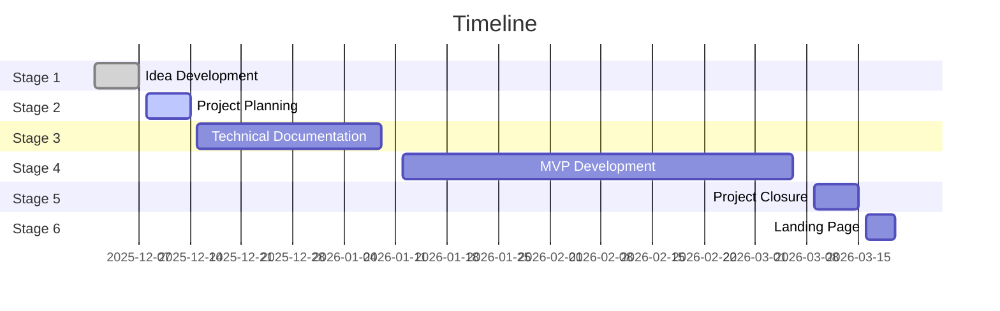

# Portfolio Project (Card Vault)
> Project Planning

## Main project planning

## Detailled project planning

| Steps  | Commentary                                                                                                       |
| ------ | ---------------------------------------------------------------------------------------------------------------- |
| Step 1 | Create the GitHub repository  Set up Docker Compose + configure the React, Python, and PostgreSQL environment |
| Step 2 | Create mockups + define the visual identity / style guide                                                        |
| Step 3 | Set up API routes (Dashboard, Profile, Scan, Stats, Vault, Search) + Python backend unit tests                   |
| Step 4 | Authentication + Registration                                                                                    |
| Step 5 | Creation and training of the Siamese neural network machine learning model                                       |
| Step 6 | AI integration with the backend + Python unit tests for the AI                                                   |
| Step 7 | Frontend display + React unit tests + full UI/UX flow tests                                                      |
| Step 8 | Web app deployment + performance testing                                                                         |
| Step 9 | Final review + bug fixing + documentation writing                                                                |
