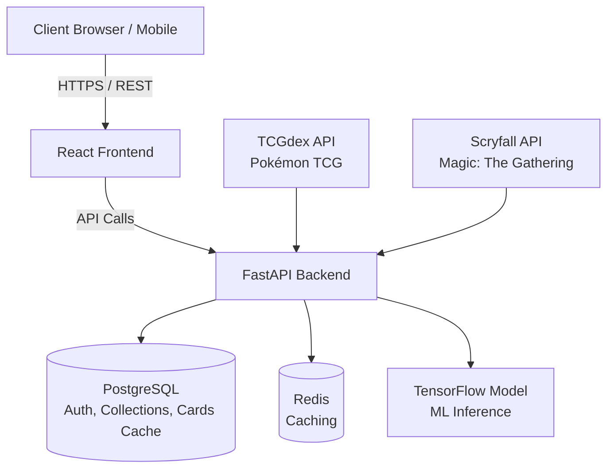

# Portfolio Project - Card Vault
> Technical Documentation

## Table of Contents
- 1 [User stories and Mockups](#1-user-stories-and-mockup)
  - 1.1 [User stories](#11-user-stories)
    - 1.1.1 [User story](#111-user-story)
    - 1.1.2 [MoSCoW](#112-moscow)
  - 1.2 [Mockup](#2-mockup)
- 2 [Design System Architecture](#2-design-system-architecture)
- 3 [Components Classes and Database Design](#3-components-classes-and-database-design)
  - 3.1 [Component and class descriptions](#31-component-and-class-descriptions)
  - 3.2 [Database design](#32-database-design)
- 4 [Sequence diagram](#4-sequence-diagram)
- 5 [API](#5-api)
  - 5.1 [External APIs](#51-external-apis)
  - 5.2 [Internal APIs](#52-internal-apis)
- 6 [SCM and QA](#6-scm-and-qa)
  - 6.1 [SCM](#61-scm)
  - 6.2 [QA](#62-qa)

---

#### 1 Technology Stack
**Frontend:**
- **Framework:** React + Vite
- **Styling:** CSS Modules
- **State Management:** React Hooks + Context API
- **Charts:** Recharts
- **Icons:** Lucide React
- **HTTP Client:** Axios
- **Theme Management:** CSS Variables (Dark mode support)
- **Responsive:** Mobile-first approach with CSS Grid/Flexbox

**Backend:**
- **Framework:** FastAPI
- **Database:** PostgreSQL
- **ORM:** SQLAlchemy
- **Caching:** Redis
- **Authentication:** JWT
- **Validation:** Pydantic
- **Migrations:** Alembic
- **Rate Limiting:** slowapi

**Machine Learning:**
- **Framework:** TensorFlow / Keras
- **Base Model:** MobileNetV2 (transfer learning)
- **Image Processing:** PIL + OpenCV
- **Training Format:** .h5
- **Production Format:** .tflite (optimized for mobile)
- **Model Versioning:** MLflow or DVC
- **Dataset Management:** Custom annotation pipeline

**Infrastructure & DevOps:**
- **Container:** Docker + Docker Compose
- **CI/CD:** GitHub Actions
- **Environment Management:** .env files per environment
- **Monitoring:** Basic logging (expandable post-MVP)

---

#### 2 System Architecture
##### 2.1 System


**Architecture Notes:**
- **Stateless Backend:** JWT-based authentication for horizontal scalability
- **Caching Strategy:** Redis for frequently accessed card data (24h TTL)
- **ML Inference:** Synchronous for MVP, async queue for post-MVP
- **Database:** PostgreSQL with proper indexing on collection queries
- **Rate Limiting:** Applied to recognition endpoints (10 requests/minute per user)

**External APIs Integration:**
- **TCGdex (Pokémon TCG):** Base URL `https://api.tcgdex.net/v2/en`, reasonable use policy, 24h caching for card data
- **Scryfall (Magic: The Gathering):** Base URL `https://api.scryfall.com`, 10 requests/second rate limit, 24h caching for card data

> **Primary Key** -> PK  
> **Foreign Key** -> FK  
> **Unique** -> U  
> **Optionnal** -> O

---

#### 3 Data models
##### 3.1 User
```
- id (PK)
- email (U)
- username (U)
- password_hash
- created_at
- updated_at
- is_admin
```

##### 3.2 Card
```
- id (PK)
- api_id (U)
- franchise
- illustrator
- image_url
- name
- rarity
- set_name
- set_id
- set_total
- card_number
- rarity
- market_price
- created_at
```

##### 3.3 UserCollection
```
- id (PK)
- user_id (FK → User)
- card_id (FK → Card)
- quantity (default: 1)
- condition (Mint / NM / LP / MP / HP)
- purchase_price (O)
- purchase_date (O)
- notes (O)
- added_at
- updated_at
```

##### 3.4 RecognitionLog
```
- id (PK)
- user_id (FK → User)
- uploaded_image_path
- model_predictions (JSON: top 3 with scores)
- user_confirmation (which card was correct)
- created_at
- feedback ("correct" / "wrong")
```

##### 3.5 Relations
```
User --(1:N)--> UserCollection --(N:1)-- Card
User --(1:N)--> RecognitionLog
```

---

#### 4 API Backend
##### 4.1 Auth
```
POST   /api/auth/register          # Create account
POST   /api/auth/login             # Auth (return JWT)
POST   /api/auth/refresh           # Refresh JWT token
POST   /api/auth/logout            # Logout
GET    /api/auth/me                # User profile
```

##### 4.2 Cards
```
GET    /api/cards                  # Paginate list
GET    /api/cards/{id}             # Card details
GET    /api/cards/search           # Text research
GET    /api/sets                   # Sets lists
GET    /api/rarities               # Rarity list
```

**Query Parameters :**
- `?page=1&limit=20` - Pagination
- `?set=base1` - Filter by set
- `?rarity=rare` - Filter by rarity
- `?name=Charizard` - Research by name
- `?sort=price_asc|price_desc|name_asc|name_desc` - Sort

##### 4.3 Collection
```
GET    /api/me/collection          # Complete collection
POST   /api/me/collection          # Add card
PUT    /api/me/collection/{id}     # Update card
DELETE /api/me/collection/{id}     # Delete card
GET    /api/me/collection/stats    # Stats
```

**Payload POST/PUT :**
```json
{
  "card_id": "uuid",
  "quantity": 2,
  "condition": "Near Mint",
  "purchase_price": 45.50,
  "purchase_date": "2024-01-15",
  "notes": "Mint condition, from booster box"
}
```

##### 4.4 ML recognition
```
POST   /api/recognition/upload     # Image upload
POST   /api/recognition/scan       # Image scan
GET    /api/recognition/history    # History
POST   /api/recognition/feedback   # User feedback
```

**Payload POST /recognition/upload :**
```json
{
  "image": "<multipart-file>"
}
```

**Response :**
```json
{
  "success": true,
  "results": [
    {
      "rank": 1,
      "card_id": "uuid",
      "name": "Charizard",
      "confidence": 0.94,
      "image_url": "https://...",
      "set_name": "Base Set"
    },
    {
      "rank": 2,
      "card_id": "uuid",
      "name": "Charizard-ex",
      "confidence": 0.04,
      "image_url": "https://...",
      "set_name": "Base Set"
    },
    {
      "rank": 3,
      "card_id": "uuid",
      "name": "Dark Charizard",
      "confidence": 0.02,
      "image_url": "https://...",
      "set_name": "Jungle"
    }
  ],
  "processing_time_ms": 234
}
```

---

#### 5 Frontend
##### 5.1 Routing
```
/                          # Home (Search)
/search                    # Search results
/cards/{id}                # Card details
/collection                # My collection
/recognition               # Upload & recognition
/stats                     # Stats
/auth/login                # Login
/auth/register             # Register
/profile                   # User profile
```

##### 5.2 Main pages
**Home / Search (/)**
- Search bar
- Visual filters (rarity, set, price range)
- Responsive grid 1-6 columns
- Pagination
- Hover effects on cards

**Recognition (/recognition)**
- Upload area
- Loader during processing
- Top 3 results with confidence
- Buttons: Correct, Wrong, Unclear, Skip

**Collection (/collection)**
- Switchable table/grid view
- Columns: Image, Name, Set, Quantity, Condition, Value
- Inline editing
- Filters & sorting
- Total value displayed

**Stats (/stats)**
- KPIs: Number of cards, Total value
- Pie chart: rarity distribution
- Bar chart: set distribution
- Top 10 most expensive cards

---
