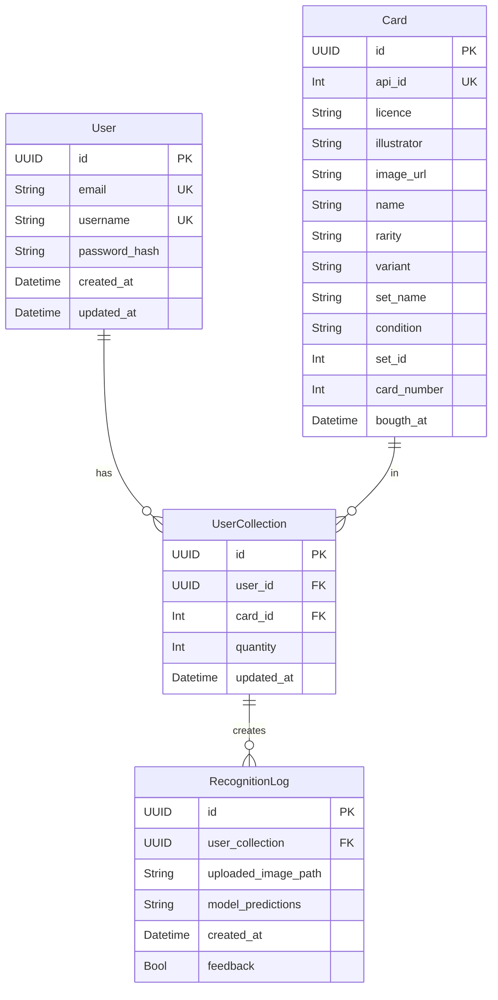
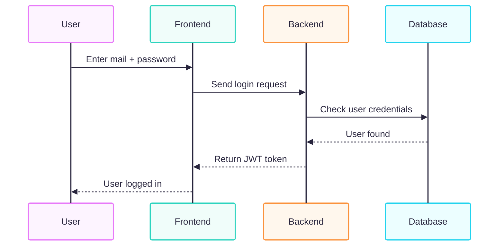
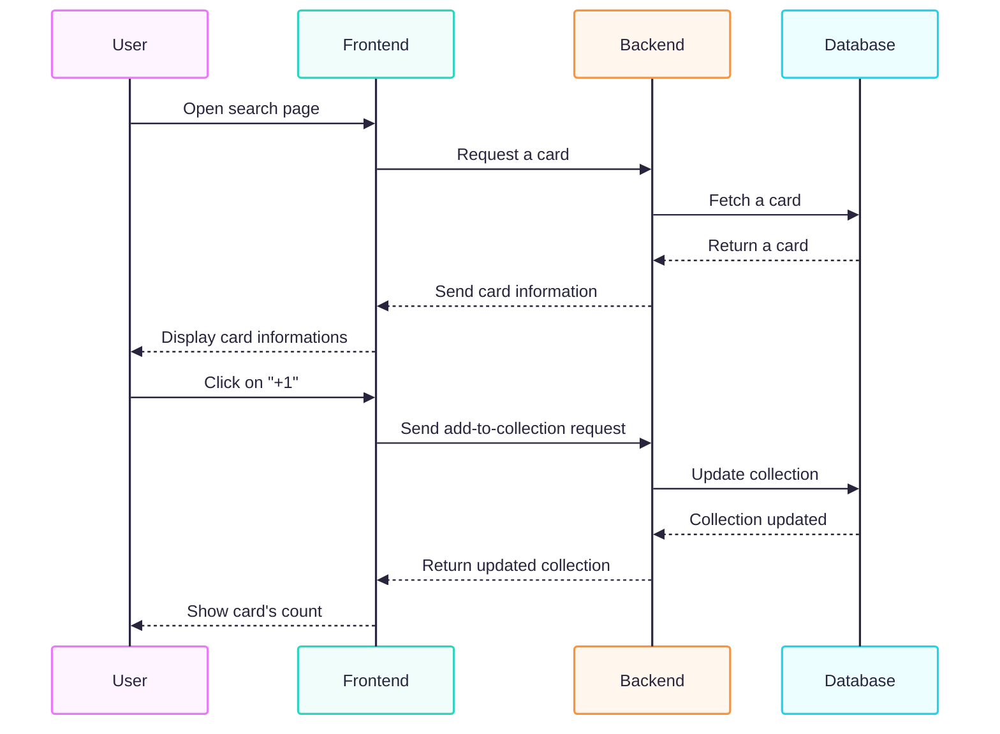
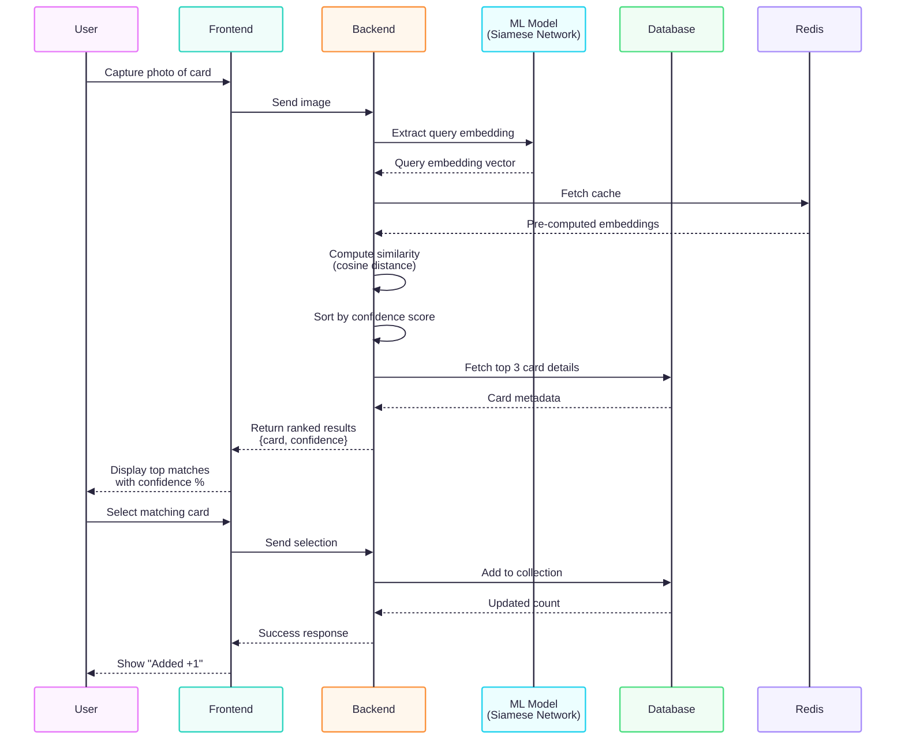

# Portfolio Project - Card Vault
> Technical Documentation

## Table of Contents
- 1 [User stories and Mockups](#1-user-stories-and-mockup)
  - 1.1 [User stories](#11-user-stories)
  - 1.2 [Mockup](#2-mockup)
- 2 [Design System Architecture](#2-design-system-architecture)
- 3 [Components Classes and Database Design](#3-components-classes-and-database-design)
  - 3.1 [Component and class descriptions](#31-component-and-class-descriptions)
  - 3.2 [Database design](#32-database-design)
- 4 [Sequence diagram](#4-sequence-diagram)
  - 4.1 [Login](#41-login)
  - 4.2 [Add a card to collection](#42-add-a-card-to-collection)
  - 4.3 [Scan a card](#43-scan-a-card)
- 5 [API](#5-api)
  - 5.1 [External APIs](#51-external-apis)
  - 5.2 [Internal APIs](#52-internal-apis)
- 6 [SCM and QA](#6-scm-and-qa)
  - 6.1 [SCM](#61-scm)
  - 6.2 [QA](#62-qa)

---
## 1 User stories and Mockups
### 1.1 User stories
**Must Have (essential for MVP)**
- As a collector, I want to sign up and log in so that I can save my card collection.
- As a collector, I want to scan a Pokémon or Magic card using my phone’s camera so that it is automatically identified and added to my collection.
- As a collector, I want to search for cards by name, set, or rarity in order to check whether I already own them.
- As a collector, I want to view the total number of cards and the estimated value of my collection so that I can track its growth.

**Should Have (important, but not critical for MVP)**
- As a user, I want to be able to delete my account.
- As a user, I want to manage my profile so that I can change my email address and password.

**Could Have (nice to have, future)**
- As a user, I want to be able to change the theme of my application with different colors.
- As a user, I want to be able to export or import a file of my collection.
- As a user, I want to be able to change my profile picture. 

**Won’t Have (excluded for MVP)**
- As a user, I want to have a badge system in order to get a global overview of my progress.
- As a user, I want to add friends so that I can exchange and discuss the same topics.
### 1.2 Mockup

/// add here ///

## 2 Design System Architecture

  

## 3 Components Classes and Database Design
### 3.1 Component and class descriptions
#### 3.1.1 Front-end Components (React)
| Component / Page | Type.        | Purpose                                                                                                                                     | 
| ---------------- | ------------ | ------------------------------------------------------------------------------------------------------------------------------------------- |
| /                | Page         | Home page with display of general statistics visualization, including license display, extensions, and access to the profile, search.       |
| /scan            | Page         | Access to the search page, single-card scan, and multi-page scan.                                                                           |
| /scan/scan_card  | Page         | Displays what the camera sees to scan a card.                                                                                               |
| /scan/builk_scan | Page         | Displays filters to pre-record information across multiple cards.                                                                           |
| /search          | Page         | Displays the different filters for searching a card.                                                                                        |
| /stats           | Page         | Displays global statistics, including card, license, franchise, and related stats.                                                          |
| /profile      | Page         | Displays user information.                                                                                                                  |
| /settings        | Page         | Displays the necessary elements: profile, Discord, terms of service, logout, etc.                                                           |
| /recognition     | Page         | Displays the scanned cards with an approve button, a reject button, and the match percentage between the real card and the AI’s suggestion. |
| /cards/{id}      | Page         | Displays the information of a card picture, name, licence, extension.                                                                       |
| /vault           | Page         | Display the collection                                                                                                                      |
| /auth/login      | Page         | User login with email and password.                                                                                                         |
| /auth/register   | Page         | User registration (create account).                                                                                                         |
| `header`         | UI Component | Access to the profile and search pages.                                                                                                     |
| `menu`           | UI Component | Smartphone menu                                                                                                                             |

#### 3.1.2 Back-end Classes (Python + FastAPI)

/// add here ///

#### 3.1.3 Relational Database

### 3.2 Database design

/// add here ///

## 4 Sequence diagram
### 4.1 Login

### 4.2 Add a card to collection

### 4.3 Scan a card

## 5 API
### 5.1 External APIs

/// add here ///

### 5.2 Internal APIs

/// add here ///

## 6 SCM and QA
### 6.1 SCM

/// add here ///

### 6.2 QA

/// add here ///
