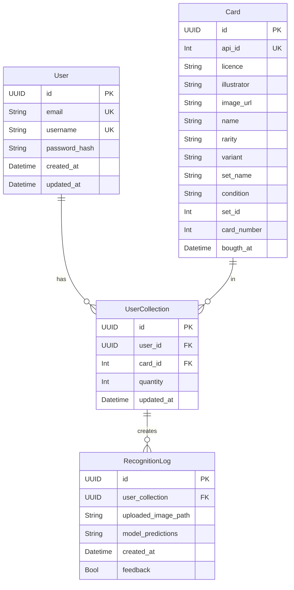
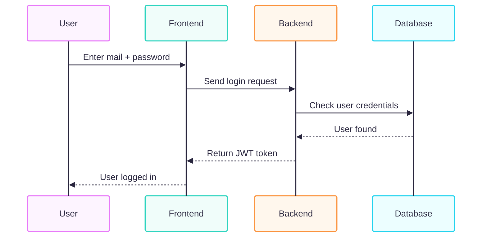
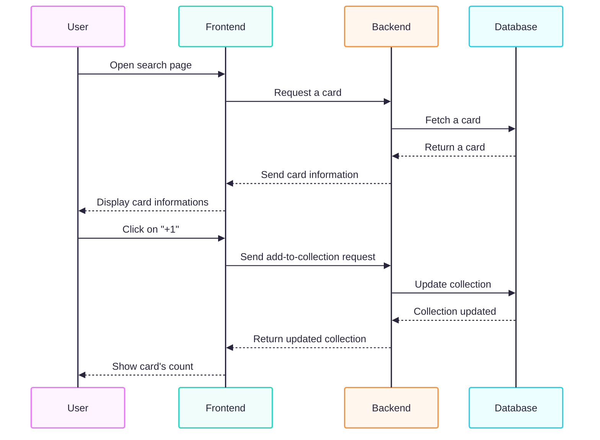
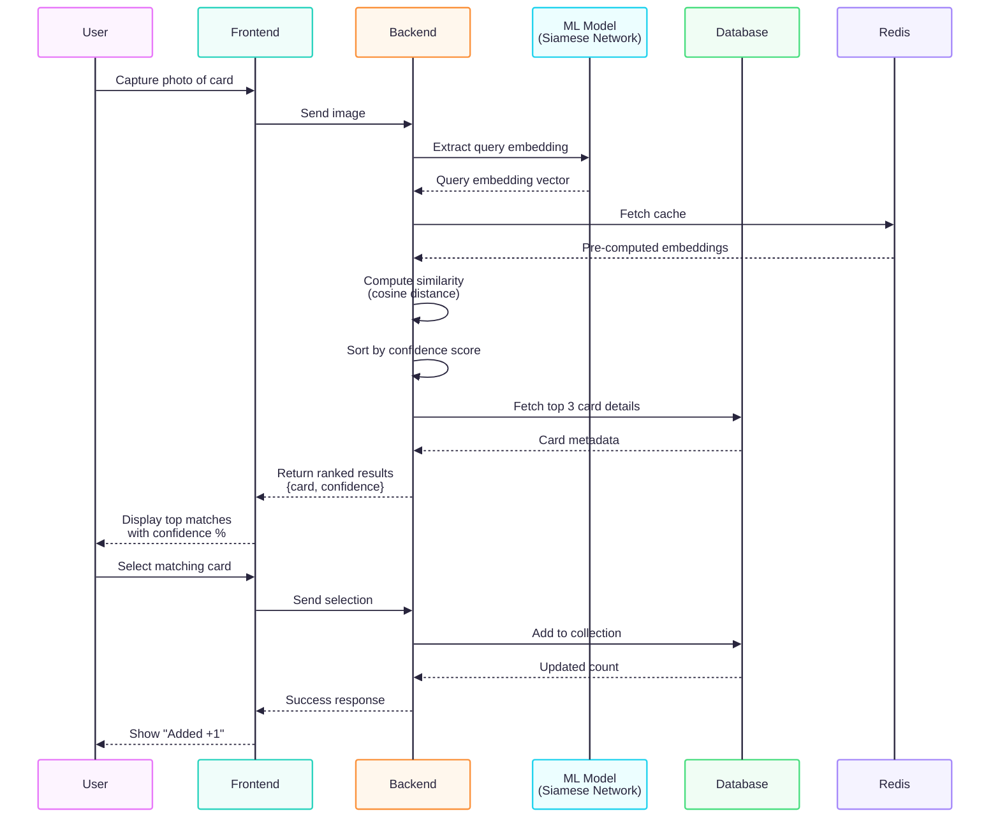

# Portfolio Project - Card Vault
> Technical Documentation

## Table of Contents
- 1 [User stories and Mockups](#1-user-stories-and-mockup)
  - 1.1 [User stories](#11-user-stories)
  - 1.2 [Mockup](#2-mockup)
- 2 [Design System Architecture](#2-design-system-architecture)
- 3 [Components Classes and Database Design](#3-components-classes-and-database-design)
  - 3.1 [Component and class descriptions](#31-component-and-class-descriptions)
  - 3.2 [Database design](#32-database-design)
- 4 [Sequence diagram](#4-sequence-diagram)
  - 4.1 [Login](#41-login)
  - 4.2 [Add a card to collection](#42-add-a-card-to-collection)
  - 4.3 [Scan a card](#43-scan-a-card)
- 5 [API](#5-api)
  - 5.1 [External APIs](#51-external-apis)
  - 5.2 [Internal APIs](#52-internal-apis)
- 6 [SCM and QA](#6-scm-and-qa)
  - 6.1 [SCM](#61-scm)
  - 6.2 [QA](#62-qa)

---
## 1 User stories and Mockups
### 1.1 User stories
**Must Have (essential for MVP)**
- As a collector, I want to sign up and log in so that I can save my card collection.
- As a collector, I want to scan a Pokémon or Magic card using my phone’s camera so that it is automatically identified and added to my collection.
- As a collector, I want to search for cards by name, set, or rarity in order to check whether I already own them.
- As a collector, I want to view the total number of cards and the estimated value of my collection so that I can track its growth.

**Should Have (important, but not critical for MVP)**
- As a user, I want to be able to delete my account.
- As a user, I want to manage my profile so that I can change my email address and password.

**Could Have (nice to have, future)**
- As a user, I want to be able to change the theme of my application with different colors.
- As a user, I want to be able to export or import a file of my collection.
- As a user, I want to be able to change my profile picture. 

**Won’t Have (excluded for MVP)**
- As a user, I want to have a badge system in order to get a global overview of my progress.
- As a user, I want to add friends so that I can exchange and discuss the same topics.
### 1.2 Mockup

[View interactive mockups on Figma] (https://www.figma.com/proto/ulYEd6G3xLZFBsNET3VfTA/Sans-titre?node-id=0-1&t=U27dBn7oGFSitgQT-1)

## 2 Design System Architecture

<p align="center">
  
</p>

## 3 Components Classes and Database Design
### 3.1 Component and class descriptions
#### 3.1.1 Front-end Components (React)
| Component / Page | Type.        | Purpose                                                                                                                                     | 
| ---------------- | ------------ | ------------------------------------------------------------------------------------------------------------------------------------------- |
| /                | Page         | Home page with display of general statistics visualization, including license display, extensions, and access to the profile, search.       |
| /scan            | Page         | Access to the search page, single-card scan, and multi-page scan.                                                                           |
| /scan/scan_card  | Page         | Displays what the camera sees to scan a card.                                                                                               |
| /scan/builk_scan | Page         | Displays filters to pre-record information across multiple cards.                                                                           |
| /search          | Page         | Displays the different filters for searching a card.                                                                                        |
| /stats           | Page         | Displays global statistics, including card, license, franchise, and related stats.                                                          |
| /profile <br>    | Page         | Displays user information.                                                                                                                  |
| /settings        | Page         | Displays the necessary elements: profile, Discord, terms of service, logout, etc.                                                           |
| /recognition     | Page         | Displays the scanned cards with an approve button, a reject button, and the match percentage between the real card and the AI’s suggestion. |
| /cards/{id}      | Page         | Displays the information of a card picture, name, licence, extension.                                                                       |
| /vault           | Page         | Display the collection                                                                                                                      |
| /auth/login      | Page         | User login with email and password.                                                                                                         |
| /auth/register   | Page         | User registration (create account).                                                                                                         |
| `header`         | UI Component | Access to the profile and search pages.                                                                                                     |
| `menu`           | UI Component | Smartphone menu                                                                                                                             |

#### 3.1.2 Back-end Classes (Python + FastAPI)

<p align="center">
  
</p>

### 3.2 Relational Database


## 4 Sequence diagram
### 4.1 Login

### 4.2 Add a card to collection

### 4.3 Scan a card

## 5 API
### 5.1 External APIs Used

| API | Purpose | Why chosen |
|-----|---------|-----------|
| **TCGdex** | Pokémon TCG card database & data | Comprehensive Pokémon card catalog, high-quality images, multi-language support, RESTful API with clear documentation, active maintenance |
| **Scryfall** | Magic: The Gathering card database & data | Most complete MTG card database, advanced search capabilities, high-quality card images, excellent documentation, strong community support |

---

### 5.2 Internal APIs Endpoints (MVP)

### 5.2.1 Authentication

| Method | Endpoint | Description | Input (JSON / Query) | Output (JSON) |
|--------|----------|-------------|---------------------|---------------|
| POST | `/api/auth/register` | Create new user account with secure password | `{ "email": "string", "username": "string", "password": "string" }` | `{ "id": "uuid", "email": "string", "username": "string", "message": "Account created successfully" }` |
| POST | `/api/auth/login` | Authenticate user and get JWT tokens | `{ "email": "string", "password": "string" }` | `{ "accessToken": "jwt_token", "refreshToken": "jwt_token", "expiresIn": 3600 }` |
| POST | `/api/auth/logout` | Logout user and invalidate tokens | Header: `Authorization: Bearer <token>` | `{ "message": "Logged out successfully" }` |
| GET | `/api/auth/me` | Get logged-in user profile | Header: `Authorization: Bearer <token>` | `{ "id": "uuid", "email": "string", "username": "string", "createdAt": "ISO8601" }` |

---

### 5.2.2 Card Database & Browse

#### Core Card Endpoints

| Method | Endpoint | Description | Input (Query / Path) | Output (JSON) |
|--------|----------|-------------|---------------------|---------------|
| GET | `/api/licenses` | List all available TCG licenses/franchises | none | `[ { "id": "uuid", "name": "Pokémon TCG", "api_source": "TCGdex", "icon_url": "url" }, { "id": "uuid", "name": "Magic: The Gathering", "api_source": "Scryfall", "icon_url": "url" } ]` |
| GET | `/api/licenses/{id}/sets` | List all sets/extensions for a specific license | Path param: `id` + `?page=1&limit=20` | `{ "data": [ { "id": "uuid", "name": "Base Set", "license_id": "uuid", "release_date": "1999-01-09", "total_cards": 102, "icon_url": "url" } ], "pagination": { "page": 1, "limit": 20, "total": 50 } }` |
| GET | `/api/sets/{id}/cards` | List all cards in a specific set | Path param: `id` + `?page=1&limit=20&sort=name_asc` | `{ "data": [ { "id": "uuid", "name": "Charizard", "set_id": "uuid", "rarity": "rare", "image_url": "url", "type": "Pokémon", "hp": 120 } ], "pagination": { "page": 1, "limit": 20, "total": 102 } }` |
| GET | `/api/cards/{id}` | Get detailed information for a specific card | Path param: `id` | `{ "id": "uuid", "name": "Charizard", "set_id": "uuid", "set_name": "Base Set", "license": "Pokémon TCG", "rarity": "rare", "image_url": "url", "type": "Pokémon", "hp": 120, "description": "string", "variations": [ { "id": "uuid", "condition": "Holographic" } ] }` |

---

#### Search & Filter Endpoints

| Method | Endpoint | Description | Input (Query / Path) | Output (JSON) |
|--------|----------|-------------|---------------------|---------------|
| GET | `/api/cards/search` | Full-text search for cards by name or properties | `?q=Charizard&license=pokemon&set=base1&rarity=rare&limit=20` | `[ { "id": "uuid", "name": "Charizard", "set": "Base Set", "license": "Pokémon TCG", "image_url": "url", "rarity": "rare" } ]` |

**Query Parameters (for all card listing endpoints):**
- `?page=1&limit=20` - Pagination (default: page 1, 20 items per page)
- `?license=pokemon|mtg` - Filter by TCG franchise
- `?set=base1` - Filter by specific set/extension
- `?rarity=rare|uncommon|common` - Filter by rarity level
- `?name=Charizard` or `?q=Charizard` - Search by card name (full-text)
- `?type=pokemon|instant|sorcery` - Filter by card type
- `?sort=name_asc|name_desc|rarity_asc|rarity_desc|set_asc|set_desc` - Sort results

---

### 5.2.3 User Collection Management

#### Collection CRUD Operations

| Method | Endpoint | Description | Input (JSON / Path) | Output (JSON) |
|--------|----------|-------------|---------------------|---------------|
| GET | `/api/me/collection` | Get user's complete collection with filtering | Header: `Authorization: Bearer <token>` + `?page=1&limit=20&license=pokemon&sort=name_asc` | `{ "data": [ { "id": "uuid", "card_id": "uuid", "card_name": "Charizard", "license": "Pokémon TCG", "set_name": "Base Set", "quantity": 2, "condition": "Near Mint", "purchase_price": 45.50, "current_market_value": 52.00, "notes": "string", "added_at": "ISO8601" } ], "pagination": { "page": 1, "limit": 20, "total": 145 } }` |
| POST | `/api/me/collection` | Add card to collection | `{ "card_id": "uuid", "quantity": 1, "condition": "Near Mint", "purchase_price": 45.50, "purchase_date": "2024-01-15", "notes": "Mint condition, from booster box" }` | `{ "id": "uuid", "card_id": "uuid", "quantity": 1, "message": "Card added to collection" }` |
| PUT | `/api/me/collection/{id}` | Update card details in collection (quantity, condition, notes) | `{ "quantity": 3, "condition": "Mint", "purchase_price": 50.00, "purchase_date": "2024-01-20", "notes": "Updated after revaluation" }` | `{ "id": "uuid", "card_id": "uuid", "quantity": 3, "message": "Card updated successfully" }` |
| DELETE | `/api/me/collection/{id}` | Remove card from collection | Path param: `id` | `{ "message": "Card removed from collection" }` |

#### Collection Statistics & Analytics

| Method | Endpoint | Description | Input (Query) | Output (JSON) |
|--------|----------|-------------|---------------------|---------------|
| GET | `/api/me/collection/stats` | Get complete collection statistics | Header: `Authorization: Bearer <token>` | `{ "total_unique_cards": 145, "total_quantity": 287, "total_collection_value": 5432.50, "average_card_value": 37.48, "cards_by_license": { "Pokémon TCG": 120, "Magic: The Gathering": 25 }, "cards_by_rarity": { "Common": 45, "Rare": 98, "Ultra Rare": 2 }, "cards_by_condition": { "Mint": 78, "Near Mint": 95, "Light Played": 14 }, "most_valuable_cards": [ { "name": "Charizard", "value": 250.00 } ], "price_range": { "min": 2.50, "max": 250.00 } }` |
| GET | `/api/me/collection/stats/license/{license_id}` | Get statistics for cards from specific license | Header: `Authorization: Bearer <token>` + Path param: `license_id` | `{ "license": "Pokémon TCG", "total_unique_cards": 120, "total_quantity": 220, "total_value": 4800.50, "average_card_value": 40.00, "cards_by_set": { "Base Set": 45, "Jungle": 35 } }` |
| GET | `/api/me/collection/stats/set/{set_id}` | Get statistics for cards from specific set | Header: `Authorization: Bearer <token>` + Path param: `set_id` | `{ "set": "Base Set", "license": "Pokémon TCG", "total_unique_cards": 45, "total_quantity": 78, "total_value": 1250.00, "completion_percentage": 45.1, "cards_by_rarity": { "Common": 20, "Rare": 25 } }` |

**Payload for POST/PUT:**
```json
{
  "card_id": "uuid",
  "quantity": 2,
  "condition": "Near Mint",
  "purchase_price": 45.50,
  "purchase_date": "2024-01-15",
  "notes": "Mint condition, from booster box"
}
```

**Supported Card Conditions:**
- Mint (M)
- Near Mint (NM)
- Excellent (EX)
- Good (G)
- Light Played (LP)
- Played (PL)
- Poor (P)

---

### 5.2.4 ML/AI Card Recognition (Image Scanning)

#### Image Upload & Processing

| Method | Endpoint | Description | Input | Output (JSON) |
|--------|----------|-------------|-------|---------------|
| POST | `/api/recognition/upload` | Upload card image for processing | Multipart form: `image: <file>` (JPEG, PNG, max 10MB) | `{ "upload_id": "uuid", "status": "processing", "message": "Image uploaded successfully" }` |
| POST | `/api/recognition/scan` | Scan and identify card from uploaded image | `{ "upload_id": "uuid" }` | `{ "success": true, "upload_id": "uuid", "results": [ { "rank": 1, "card_id": "uuid", "name": "Charizard", "license": "Pokémon TCG", "set": "Base Set", "confidence": 0.94, "image_url": "https://...", "variations": [ { "id": "uuid", "condition": "Holographic", "confidence": 0.89 } ] }, { "rank": 2, "card_id": "uuid", "name": "Charizard-ex", "license": "Pokémon TCG", "set": "Scarlet & Violet", "confidence": 0.04, "image_url": "https://..." }, { "rank": 3, "card_id": "uuid", "name": "Dark Charizard", "license": "Pokémon TCG", "set": "Jungle", "confidence": 0.02, "image_url": "https://..." } ], "processing_time_ms": 234 }` |
| POST | `/api/recognition/feedback` | Submit user feedback to improve ML model | `{ "scan_id": "uuid", "correct_card_id": "uuid", "feedback": "correct\|incorrect\|partial", "notes": "Feedback notes (optional)" }` | `{ "message": "Feedback recorded successfully", "model_improvement": "Data collected for model retraining" }` |
| POST | `/api/recognition/add-to-collection` | Directly add scanned card result to collection | `{ "scan_id": "uuid", "result_rank": 1, "quantity": 1, "condition": "Near Mint", "purchase_price": null, "notes": "Added via camera scan" }` | `{ "success": true, "collection_item_id": "uuid", "message": "Card added to collection from scan" }` |

**ML/AI Recognition Details:**
- **Target Accuracy:** >90% for primary match
- **Supported Franchises:** Pokémon TCG, Magic: The Gathering
- **Processing Time:** ~200-300ms per image
- **Base Model:** MobileNetV2 (transfer learning)
- **Model Format (MVP):** .h5 (Keras/TensorFlow)
- **Model Format (Production):** .tflite (optimized for mobile inference)
- **Training Data:** Augmented dataset from TCGdex and Scryfall APIs
- **Model Versioning:** MLflow or DVC
- **Model Updates:** Continuous retraining based on user feedback

**Image Upload Constraints:**
- Supported formats: JPEG, PNG, WebP
- Maximum file size: 10 MB
- Recommended resolution: 800x1200 pixels minimum
- Batch scanning: Single image per request (MVP) - bulk scanning planned for V1.1

**Payload for POST /recognition/upload:**
```json
{
  "image": "<multipart-file>"
}
```

**Response example for POST /recognition/scan:**
```json
{
  "success": true,
  "upload_id": "550e8400-e29b-41d4-a716-446655440000",
  "results": [
    {
      "rank": 1,
      "card_id": "uuid-charizard-base",
      "name": "Charizard",
      "license": "Pokémon TCG",
      "set": "Base Set",
      "confidence": 0.94,
      "image_url": "https://images.tcgdex.net/...",
      "variations": [
        {
          "id": "uuid-holo",
          "condition": "Holographic",
          "confidence": 0.89
        }
      ]
    },
    {
      "rank": 2,
      "card_id": "uuid-charizard-ex",
      "name": "Charizard-ex",
      "license": "Pokémon TCG",
      "set": "Scarlet & Violet",
      "confidence": 0.04,
      "image_url": "https://images.tcgdex.net/..."
    },
    {
      "rank": 3,
      "card_id": "uuid-dark-charizard",
      "name": "Dark Charizard",
      "license": "Pokémon TCG",
      "set": "Jungle",
      "confidence": 0.02,
      "image_url": "https://images.tcgdex.net/..."
    }
  ],
  "processing_time_ms": 234
}
```

---


## 6 SCM and QA Strategy

### 6.1 Source Control Management (SCM)

We use Git for version control.

- **main** → always contains production-ready code.
- **dev** → each new feature or bugfix is developed in its own branch and when it's ready we push it to the main branch.

---

### 6.2 QA (Quality Assurance)

We want to make sure the code works and is easy to maintain.

**Testing strategy:**
- Unit tests → check small pieces of code (with Jest for JavaScript, doctest for Python).
- API tests → check endpoints like `/api/auth/login`, `/api/cards/search` (with Jest + Supertest).
- Manual tests → check important flows manually (with Postman).
- ML/AI tests → validate model accuracy and performance (with pytest).

**Tools:**
- **Jest** → run automated tests for JavaScript/TypeScript code.
- **pytest** → run ML model tests and Python unit tests.
- **doctest** → test Python functions directly from docstrings.
- **Postman** → test API calls manually.
- **ESLint + Prettier** → keep JavaScript/TypeScript code clean and formatted.
- **pycodestyle** → enforce PEP 8 style guide for Python code.
- **mypy** → static type checking for Python code to catch type errors.

---

### 6.3 Deployment Pipeline

- **Development** → local machine, quick tests.
- **Staging** → test environment with real database and TCGdex/Scryfall test APIs.
- **Production** → real mobile app and web app.

**Steps:**
- Push code to dev.
- CI runs tests automatically (Jest, pytest, doctest).
- CI runs code quality checks (ESLint, Prettier, pycodestyle, mypy).
- If all tests pass → deploy to staging.
- Manual check (authentication, card search, collection management, ML scanning).
- Merge into main → deploy to production.

---

## 👉 In short:

- Use Git branches (dev → main).
- Write small commits + do code reviews.
- Run automated tests with Jest (JavaScript) and pytest (Python).
- Test Python code with doctest for inline examples.
- Test APIs with Postman.
- Keep code clean with ESLint + Prettier (JavaScript) and pycodestyle + mypy (Python).
- Deploy first to staging, then to production.
