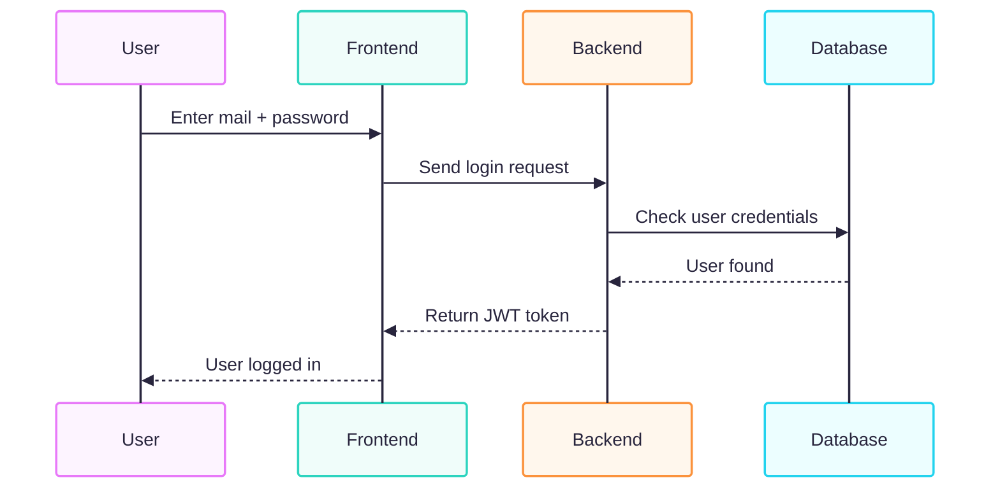
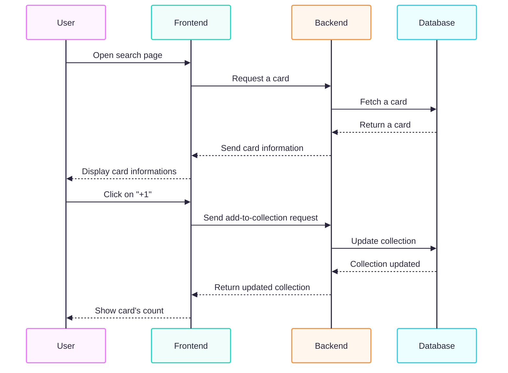
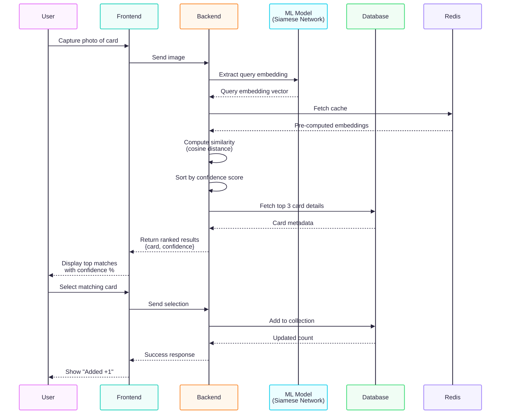

# Portfolio Project - Card Vault
> Technical Documentation

## Table of Contents
- 1 [User stories and Mockups](#1-user-stories-and-mockup)
  - 1.1 [User stories](#11-user-stories)
    - 1.1.1 [User story](#111-user-story)
    - 1.1.2 [MoSCoW](#112-moscow)
  - 1.2 [Mockup](#2-mockup)
- 2 [Design System Architecture](#2-design-system-architecture)
- 3 [Components Classes and Database Design](#3-components-classes-and-database-design)
  - 3.1 [Component and class descriptions](#31-component-and-class-descriptions)
  - 3.2 [Database design](#32-database-design)
- 4 [Sequence diagram](#4-sequence-diagram)
  - 4.1 [Login](#41-login)
  - 4.2 [Add a card to collection](#42-add-a-card-to-collection)
  - 4.3 [Scan a card](#43-scan-a-card)
- 5 [API](#5-api)
  - 5.1 [External APIs](#51-external-apis)
  - 5.2 [Internal APIs](#52-internal-apis)
- 6 [SCM and QA](#6-scm-and-qa)
  - 6.1 [SCM](#61-scm)
  - 6.2 [QA](#62-qa)

---

## 4 Sequence diagram
### 4.1 Login

### 4.2 Add a card to collection

### 4.3 Scan a card

